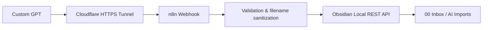

# ChatGPT → Obsidian Automation

A small AI-assisted automation project that connects ChatGPT with a local Obsidian knowledge base through n8n and REST APIs.

The goal is simple: while studying or researching with ChatGPT, selected information can be saved directly into Obsidian as structured Markdown notes instead of being copied manually.

## Architecture



Flow:

`Custom GPT → Cloudflare Tunnel → n8n Webhook → Obsidian Local REST API → Obsidian Vault`

## What it does

- Accepts a note title and Markdown content from a Custom GPT Action
- Sends the request to an n8n webhook
- Validates the incoming payload
- Sanitizes the note title before it is used as a filename
- Restricts all writes to a fixed folder: `00 Inbox/AI Imports`
- Creates the note through the Obsidian Local REST API
- Returns the saved title and vault-relative path to the caller

## Safety design

The GPT does **not** have unrestricted write access to the Obsidian vault.

The destination folder is hard-coded in the n8n workflow:

```text
00 Inbox/AI Imports
```

The incoming request cannot choose another vault path.

The workflow also:

- rejects empty note content
- limits note content to approximately 1 MB
- removes characters that are unsafe in filenames
- blocks simple path-traversal patterns such as `..`
- handles reserved Windows filenames
- limits generated filenames to 120 characters

This keeps AI-generated content in a review inbox before it is manually organized elsewhere in the vault.

## Repository structure

```text
chatgpt-obsidian-automation/
├── README.md
├── .gitignore
├── n8n/
│   └── obsidian-ai-workflow.json
└── openapi/
    └── schema.yaml
```

## Components

### Custom GPT Action

The GPT Action uses the OpenAPI schema in:

```text
openapi/schema.yaml
```

The public schema contains a placeholder server URL:

```text
https://YOUR_PUBLIC_N8N_URL
```

In the current development setup, this is replaced with the temporary public URL generated by Cloudflare Tunnel.

### n8n workflow

The workflow in:

```text
n8n/obsidian-ai-workflow.json
```

contains four main nodes:

1. **Webhook** — receives the note request
2. **Validate and Prepare Note** — validates content and sanitizes the filename
3. **Write Note to Obsidian** — sends the Markdown note to the Obsidian Local REST API
4. **Return Success Response** — returns the saved title and path

The exported workflow is intentionally inactive and does not include credentials.

### Obsidian Local REST API

The workflow writes to the local Obsidian REST endpoint through:

```text
https://host.docker.internal:27124
```

This is suitable for the current setup, where n8n runs inside Docker and Obsidian runs on the host machine.

Depending on the environment, this address may need to be changed.

## Authentication

There are two separate authentication points.

### 1. Custom GPT → n8n

The OpenAPI schema defines a custom API-key header:

```text
X-Obsidian-Webhook-Secret
```

The same secret is configured in:

- the Custom GPT Action authentication settings
- the n8n Webhook Header Auth credential

The actual secret is never stored in this repository.

### 2. n8n → Obsidian

The Obsidian Local REST API credential is configured separately inside n8n.

No API keys, tokens, passwords, or credential values are included in this repository.

## Running the current setup

The project currently runs locally and requires a short manual startup process for each session.

### 1. Start Obsidian

Open Obsidian and make sure the Local REST API plugin is available.

The destination folder must exist:

```text
00 Inbox/AI Imports
```

### 2. Start Docker Desktop

n8n is self-hosted locally through Docker, so Docker Desktop must be running before n8n becomes available.

### 3. Open the local n8n instance

Open n8n in the browser and make sure the workflow is available.

### 4. Create a temporary public HTTPS endpoint

Open a terminal and run:

```powershell
cloudflared tunnel --url http://localhost:5678
```

Cloudflare generates a temporary `trycloudflare.com` URL.

Update the `servers.url` value in the Custom GPT Action schema with this new URL.

For example:

```yaml
servers:
  - url: https://YOUR-TEMPORARY-URL.trycloudflare.com
```

Because the quick tunnel URL changes between sessions, this step currently has to be repeated whenever a new tunnel is started.

### 5. Generate a fresh webhook secret

In a second PowerShell terminal, generate a random 64-character hexadecimal secret:

```powershell
$newWebhookSecret = -join ((1..64) | ForEach-Object { '{0:x}' -f (Get-Random -Maximum 16) })
$newWebhookSecret | Set-Clipboard
```

The generated value is copied to the clipboard.

### 6. Configure the same secret on both sides

In the **Custom GPT Action authentication settings**:

- Authentication type: API Key
- Header name: `X-Obsidian-Webhook-Secret`
- API key: the newly generated secret

In the **n8n Webhook Header Auth credential**:

- Name: `X-Obsidian-Webhook-Secret`
- Value: the same newly generated secret

### 7. Run the workflow

Once the following are active:

- Obsidian
- Docker Desktop
- n8n
- the Cloudflare Tunnel
- the matching webhook secret
- the updated Custom GPT Action URL

the Custom GPT can send Markdown notes through n8n into the restricted Obsidian inbox.

## Current development limitations

The current setup works, but it is intentionally still a prototype and includes manual configuration.

- The Cloudflare quick-tunnel URL changes between sessions and has to be updated manually in the Custom GPT Action schema.
- In the current setup, reusing the previous webhook secret has not worked reliably. A new 64-character secret is therefore generated and configured on both sides for each session. The reason for this behavior has not yet been isolated.
- Sending multiple notes with the same title may overwrite the same Markdown file.
- The workflow does not yet include a dedicated error-response branch.
- Notes are routed only to the fixed AI Imports folder.
- Automatic categorization, duplicate detection, and metadata enrichment are not yet implemented.

## Local certificate note

The included n8n workflow currently allows unauthorized certificates for the local Obsidian HTTPS request because local/self-signed certificates may be used in this setup.

This is a local-development convenience, not a recommendation for public production services.

## Next steps

- investigate why the previous webhook secret cannot currently be reused reliably
- replace the temporary Cloudflare quick tunnel with a persistent tunnel / stable hostname
- reduce the manual startup and configuration steps
- smarter routing into courses, projects, work, and other vault areas
- automatic tags and metadata
- duplicate detection
- improved validation and error handling
- optional review/approval step before final organization

## What I learned

This project helped me gain practical experience with:

- webhooks
- REST API integrations
- workflow automation with n8n
- authentication headers
- OpenAPI schemas
- Docker-based self-hosting
- temporary HTTPS tunneling with Cloudflare
- Markdown-based knowledge management
- connecting a cloud-based AI assistant with a local tool
- adding simple safety boundaries to an AI-powered workflow

## Development approach

This project was built with the assistance of AI coding tools.

My focus was on defining the desired system behavior, designing the workflow, connecting the different services, configuring the integrations, testing the system, and iterating on the implementation.
