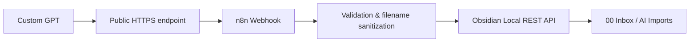

# ChatGPT → Obsidian Automation

A small AI-assisted automation project that connects ChatGPT with a local Obsidian knowledge base through n8n and REST APIs.

The goal is simple: while studying or researching with ChatGPT, selected information can be saved directly into Obsidian as structured Markdown notes instead of being copied manually.

## Architecture



Flow:

`Custom GPT → HTTPS endpoint → n8n Webhook → Obsidian Local REST API → Obsidian Vault`

## What it does

- Accepts a note title and Markdown content from a Custom GPT Action
- Sends the request to an n8n webhook
- Validates the incoming payload
- Sanitizes the note title before it is used as a filename
- Restricts all writes to a fixed folder: `00 Inbox/AI Imports`
- Creates the note through the Obsidian Local REST API
- Returns the saved title and vault-relative path to the caller

## Safety design

The GPT does **not** have unrestricted write access to the Obsidian vault.

The destination folder is hard-coded in the n8n workflow:

```text
00 Inbox/AI Imports
```

The incoming request cannot choose another vault path.

The workflow also:

- rejects empty note content
- limits note content to approximately 1 MB
- removes characters that are unsafe in filenames
- blocks simple path-traversal patterns such as `..`
- handles reserved Windows filenames
- limits generated filenames to 120 characters

This keeps AI-generated content in a review inbox before it is manually organized elsewhere in the vault.

## Repository structure

```text
chatgpt-obsidian-automation/
├── README.md
├── .gitignore
├── n8n/
│   └── obsidian-ai-workflow.json
└── openapi/
    └── schema.yaml
```

## Components

### Custom GPT Action

The GPT Action uses the OpenAPI schema in:

```text
openapi/schema.yaml
```

The public schema contains a placeholder server URL:

```text
https://YOUR_PUBLIC_N8N_URL
```

Replace it with the public HTTPS endpoint that forwards requests to your n8n webhook.

### n8n workflow

The workflow in:

```text
n8n/obsidian-ai-workflow.json
```

contains four main nodes:

1. **Webhook** — receives the note request
2. **Validate and Prepare Note** — validates content and sanitizes the filename
3. **Write Note to Obsidian** — sends the Markdown note to the Obsidian Local REST API
4. **Return Success Response** — returns the saved title and path

The exported workflow is intentionally inactive and does not include credentials.

### Obsidian Local REST API

The workflow writes to the local Obsidian REST endpoint through:

```text
https://host.docker.internal:27124
```

This is suitable for a setup where n8n runs inside Docker and Obsidian runs on the host machine.

Depending on your environment, this address may need to be changed.

## Authentication

There are two separate authentication points.

### 1. GPT → n8n

The public OpenAPI schema defines a custom header:

```text
X-Obsidian-Webhook-Secret
```

Set the real secret only in your own GPT Action and n8n credential configuration.

### 2. n8n → Obsidian

The Obsidian Local REST API credential is configured separately inside n8n.

No API keys, tokens, passwords, or credential values are included in this repository.

## Setup overview

1. Install and configure the Obsidian Local REST API plugin.
2. Run n8n and import `n8n/obsidian-ai-workflow.json`.
3. Create the required n8n credentials for:
   - webhook header authentication
   - Obsidian Local REST API authentication
4. Verify the Obsidian REST API address used by the HTTP Request node.
5. Create the folder:
   ```text
   00 Inbox/AI Imports
   ```
   inside your Obsidian vault.
6. Expose the n8n webhook through an HTTPS endpoint.
7. Replace `https://YOUR_PUBLIC_N8N_URL` in `openapi/schema.yaml`.
8. Add the schema to a Custom GPT Action and configure the same webhook secret.
9. Activate the n8n workflow and test with a sample Markdown note.

## Local certificate note

The included n8n workflow currently allows unauthorized certificates for the local Obsidian HTTPS request because local/self-signed certificates may be used in this setup.

This is a local-development convenience, not a recommendation for public production services.

## Known limitations

- Sending multiple notes with the same title may overwrite the same Markdown file.
- The current workflow does not include a dedicated error-response branch.
- Notes are routed only to the fixed AI Imports folder.
- Automatic categorization, duplicate detection, and metadata enrichment are not yet implemented.

## Next steps

- smarter routing into courses, projects, work, and other vault areas
- automatic tags and metadata
- duplicate detection
- improved validation and error handling
- optional review/approval step before final organization

## What I learned

This project helped me gain practical experience with:

- webhooks
- REST API integrations
- workflow automation with n8n
- authentication headers
- OpenAPI schemas
- Docker-based self-hosting
- Markdown-based knowledge management
- connecting a cloud-based AI assistant with a local tool
- adding simple safety boundaries to an AI-powered workflow

## Development approach

This project was built with the assistance of AI coding tools.

My focus was on defining the desired system behavior, designing the workflow, connecting the different services, configuring the integrations, testing the system, and iterating on the implementation.
